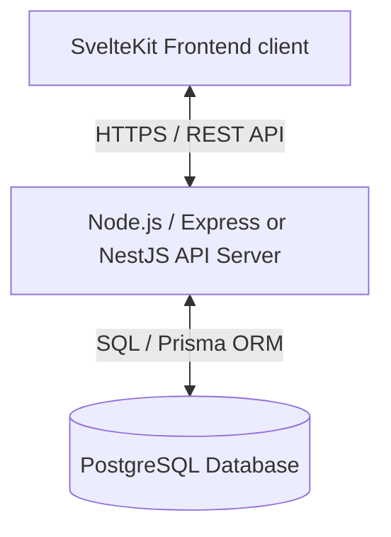
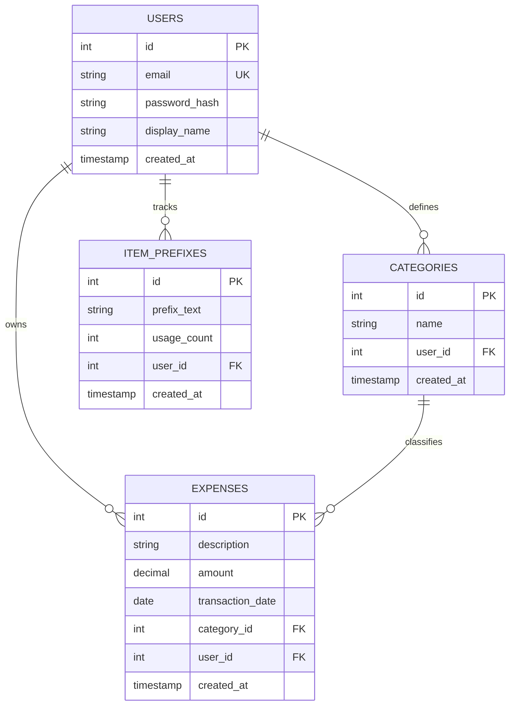

# Backend Specification: Expense Tracking System

This document outlines the backend design, database schema, API specifications, and architectural guidelines for migrating the Expense Tracking frontend app (from a localStorage-based store) to a robust client-server architecture.

---

## 1. System Architecture Overview

To support multi-user isolation, persistence, statistics aggregation, and future scalability, the system will follow a classic 3-tier architecture:



### Proposed Stack
- **Runtime Environment**: Node.js (v18+) or Bun
- **Language**: TypeScript
- **Framework**: Express.js (lightweight, flexible) or NestJS (structured, enterprise-grade)
- **Database**: PostgreSQL (recommended for production) or SQLite (for local development/testing)
- **ORM / Query Builder**: Prisma ORM or Drizzle ORM (for schema migrations and type-safe database queries)
- **Authentication**: JWT (JSON Web Tokens) with Access and Refresh tokens stored securely (HttpOnly cookies)

---

## 2. Database Schema Design (ERD)

To provide multi-user support, we introduce a `users` table. Every expense, category, and item prefix will belong to a specific user to ensure data isolation.

### Entity-Relationship Diagram (ERD)


### Database Tables Specification (PostgreSQL DDL)

#### 1. Users Table
```sql
CREATE TABLE users (
    id SERIAL PRIMARY KEY,
    email VARCHAR(255) UNIQUE NOT NULL,
    password_hash VARCHAR(255) NOT NULL,
    display_name VARCHAR(100),
    created_at TIMESTAMP WITH TIME ZONE DEFAULT CURRENT_TIMESTAMP NOT NULL
);
```

#### 2. Categories Table
```sql
CREATE TABLE categories (
    id SERIAL PRIMARY KEY,
    name VARCHAR(100) NOT NULL,
    user_id INT REFERENCES users(id) ON DELETE CASCADE NOT NULL,
    created_at TIMESTAMP WITH TIME ZONE DEFAULT CURRENT_TIMESTAMP NOT NULL,
    CONSTRAINT uq_user_category_name UNIQUE(user_id, name)
);
```

#### 3. Expenses Table
```sql
CREATE TABLE expenses (
    id SERIAL PRIMARY KEY,
    description TEXT NOT NULL,
    amount NUMERIC(12, 2) NOT NULL,
    transaction_date DATE NOT NULL,
    category_id INT REFERENCES categories(id) ON DELETE SET NULL,
    user_id INT REFERENCES users(id) ON DELETE CASCADE NOT NULL,
    created_at TIMESTAMP WITH TIME ZONE DEFAULT CURRENT_TIMESTAMP NOT NULL
);

-- Indexing for fast search and aggregation
CREATE INDEX idx_expenses_user_date ON expenses(user_id, transaction_date DESC);
CREATE INDEX idx_expenses_category ON expenses(category_id);
```

#### 4. Item Prefixes Table
```sql
CREATE TABLE item_prefixes (
    id SERIAL PRIMARY KEY,
    prefix_text VARCHAR(100) NOT NULL,
    usage_count INT DEFAULT 0 NOT NULL,
    user_id INT REFERENCES users(id) ON DELETE CASCADE NOT NULL,
    created_at TIMESTAMP WITH TIME ZONE DEFAULT CURRENT_TIMESTAMP NOT NULL,
    CONSTRAINT uq_user_prefix UNIQUE(user_id, prefix_text)
);
```

---

## 3. RESTful API Endpoints

All routes expect header: `Authorization: Bearer <JWT_TOKEN>` (except Auth routes).
All payload request/response formats are in JSON.

### 3.1 Authentication Routes

#### Register User
* **Route**: `POST /api/auth/register`
* **Request Body**:
  ```json
  {
    "email": "user@example.com",
    "password": "SecurePassword123",
    "display_name": "Somchai"
  }
  ```
* **Response (201 Created)**:
  ```json
  {
    "success": true,
    "message": "User registered successfully",
    "user": { "id": 1, "email": "user@example.com", "display_name": "Somchai" }
  }
  ```

#### Login User
* **Route**: `POST /api/auth/login`
* **Request Body**:
  ```json
  {
    "email": "user@example.com",
    "password": "SecurePassword123"
  }
  ```
* **Response (200 OK)**:
  ```json
  {
    "token": "eyJhbGciOi...",
    "user": { "id": 1, "email": "user@example.com", "display_name": "Somchai" }
  }
  ```

---

### 3.2 Category Endpoints

#### Get All Categories
* **Route**: `GET /api/categories`
* **Response (200 OK)**:
  ```json
  [
    { "id": 1, "name": "วัตถุดิบอาหาร" },
    { "id": 2, "name": "ครอบครัว" }
  ]
  ```

#### Create Category
* **Route**: `POST /api/categories`
* **Request Body**:
  ```json
  { "name": "อาหารสัตว์" }
  ```
* **Response (201 Created)**:
  ```json
  { "id": 3, "name": "อาหารสัตว์" }
  ```

#### Update Category
* **Route**: `PUT /api/categories/:id`
* **Request Body**:
  ```json
  { "name": "สัตว์เลี้ยง" }
  ```
* **Response (200 OK)**:
  ```json
  { "id": 3, "name": "สัตว์เลี้ยง" }
  ```

#### Delete Category
* **Route**: `DELETE /api/categories/:id`
* **Response (200 OK)**:
  ```json
  { "success": true, "message": "Category deleted successfully" }
  ```

---

### 3.3 Expense Endpoints

#### Get Expenses (with Filtering, Sorting, and Pagination)
* **Route**: `GET /api/expenses`
* **Query Parameters**:
  - `page`: Page number (default: `1`)
  - `pageSize`: Items per page (default: `10`)
  - `search`: Search query string matching description (default: empty)
  - `category_id`: Filter by category ID (optional)
  - `startDate`: Filter by transaction date start `YYYY-MM-DD` (optional)
  - `endDate`: Filter by transaction date end `YYYY-MM-DD` (optional)
  - `sortField`: Sort by field (`transaction_date`, `description`, `amount`) (default: `transaction_date`)
  - `sortDirection`: Sort order (`asc` or `desc`) (default: `desc`)
* **Response (200 OK)**:
  ```json
  {
    "data": [
      {
        "id": 1,
        "description": "[วัตถุดิบ] หมูสับ, เส้นใหญ่",
        "category_id": 1,
        "amount": 120.00,
        "transaction_date": "2026-05-31",
        "created_at": "2026-05-31T03:00:00.000Z"
      }
    ],
    "pagination": {
      "totalItems": 15,
      "totalPages": 2,
      "currentPage": 1,
      "pageSize": 10
    }
  }
  ```

#### Create Expense
* **Route**: `POST /api/expenses`
* **Request Body**:
  ```json
  {
    "description": "[วัตถุดิบ] หมูสับ, เส้นใหญ่",
    "category_id": 1,
    "amount": 120.00,
    "transaction_date": "2026-05-31"
  }
  ```
* **Response (201 Created)**:
  * *(Should also automatically increment the prefix usage count on the backend if a matching prefix in `[prefix]` format is found in the description)*
  ```json
  {
    "id": 1,
    "description": "[วัตถุดิบ] หมูสับ, เส้นใหญ่",
    "category_id": 1,
    "amount": 120.00,
    "transaction_date": "2026-05-31",
    "created_at": "2026-05-31T03:12:00.000Z"
  }
  ```

#### Update Expense
* **Route**: `PUT /api/expenses/:id`
* **Request Body**:
  ```json
  {
    "description": "[วัตถุดิบ] หมูสับ, เส้นใหญ่พิเศษ",
    "amount": 140.00
  }
  ```
* **Response (200 OK)**:
  ```json
  {
    "id": 1,
    "description": "[วัตถุดิบ] หมูสับ, เส้นใหญ่พิเศษ",
    "category_id": 1,
    "amount": 140.00,
    "transaction_date": "2026-05-31",
    "created_at": "2026-05-31T03:12:00.000Z"
  }
  ```

#### Delete Expense
* **Route**: `DELETE /api/expenses/:id`
* **Response (200 OK)**:
  ```json
  { "success": true, "message": "Expense deleted successfully" }
  ```

---

### 3.4 Item Prefix Endpoints

#### Get All Prefixes
* **Route**: `GET /api/prefixes`
* **Response (200 OK)**:
  ```json
  [
    { "id": 1, "prefix_text": "[วัตถุดิบ]", "usage_count": 12 },
    { "id": 2, "prefix_text": "[ของใช้บ้าน]", "usage_count": 8 }
  ]
  ```

#### Create Prefix
* **Route**: `POST /api/prefixes`
* **Request Body**:
  ```json
  { "prefix_text": "[แมว]" }
  ```
* **Response (201 Created)**:
  ```json
  { "id": 5, "prefix_text": "[แมว]", "usage_count": 0 }
  ```

#### Delete Prefix
* **Route**: `DELETE /api/prefixes/:id`
* **Response (200 OK)**:
  ```json
  { "success": true, "message": "Prefix deleted successfully" }
  ```

---

### 3.5 Statistics & Analytics (Added-value Backend Features)

#### Dashboard Summary Stats
* **Route**: `GET /api/dashboard/stats`
* **Query Parameters**:
  - `month`: (e.g. `2026-05`)
* **Response (200 OK)**:
  ```json
  {
    "totalSpent": 5869.00,
    "categoryDistribution": [
      { "category_id": 1, "name": "วัตถุดิบอาหาร", "amount": 1079.00, "percentage": 18.39 },
      { "category_id": 4, "name": "อาหารสัตว์", "amount": 1340.00, "percentage": 22.83 }
    ],
    "dailyTrend": [
      { "date": "2026-05-25", "amount": 280.00 },
      { "date": "2026-05-31", "amount": 120.00 }
    ]
  }
  ```

---

## 4. Frontend-Backend Migration Plan

To switch the current frontend implementation from `localStorage` in `expenseStore.svelte.ts` to this REST API:

1. **API Client Integration**:
   - Create an API client helper (e.g. using `fetch` or `axios`) located at `src/lib/api.ts` to manage requests, authorization headers, and token refresh.
2. **Reimplement `expenseStore.svelte.ts`**:
   - Replace the browser-only logic with calls to the backend API.
   - Use `$state` in Svelte 5 to preserve the reactive design while synchronizing actions with backend fetches.
3. **Session Store**:
   - Add a Svelte store for managing user session state (logged in user details, JWT verification state).
