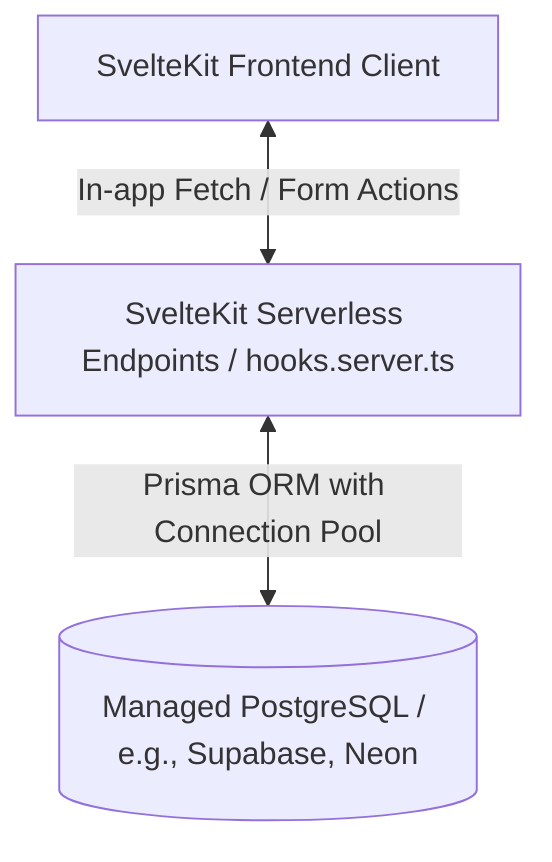

# Backend Specification: Expense Tracking System (Vercel & SvelteKit Native)

เอกสารฉบับนี้จัดทำขึ้นเพื่อกำหนดโครงสร้างสถาปัตยกรรม ฐานข้อมูล และ API Endpoints สำหรับแอปพลิเคชัน Expense Tracking โดยปรับปรุงจากระบบเดิมที่ใช้ `localStorage` มาเป็น **Full-stack Serverless Architecture** ที่รันอยู่บน Vercel และ SvelteKit อย่างสมบูรณ์

---

## 1. System Architecture Overview

เพื่อสอดรับกับแนวทางการ Deploy บน Vercel ระบบจะรวมส่วนของ Frontend และ Backend (API/Server Load) เข้าด้วยกันในโปรเจคเดียว (Monolith) โดยส่วนที่เป็น Server-side logic จะถูกแปลงเป็น **Serverless Functions** โดยอัตโนมัติเมื่อจัดส่งขึ้น Vercel

