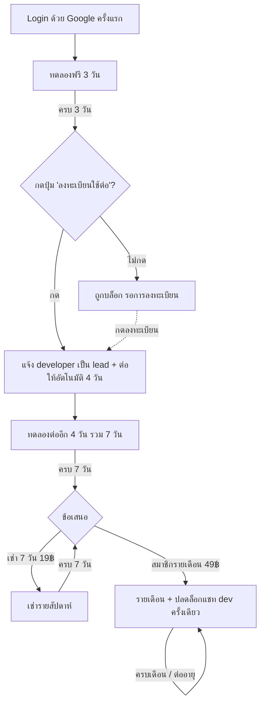

# Phase 0 (ปรับใหม่) — Progressive Trial Funnel & การเก็บเงิน

> โมเดลนี้ **แทนที่** โมเดล tier Free/Plus/Pro ใน Phase 0 ตามทิศทางที่กำหนดใหม่
> กลไก billing เบื้องหลัง (Omise / webhook / verify signature) ยังใช้ตาม [`phase-0-billing-spec.md`](./phase-0-billing-spec.md)
> Stack จริง: **SvelteKit + Auth.js (Google) + Prisma + PostgreSQL**
> อัปเดต: 31 พ.ค. 2026

---

## 0. แนวคิดหลัก

แทนที่จะแบ่งแพ็กเกจตามฟีเจอร์ เราใช้ **การให้เวลา (time-based access)** เป็นกลไกหลัก โดยใช้ "การลงทะเบียน" กลางทางเป็นเครื่องมือ **วัด demand จริง** ก่อนลงทุนทำต่อ และผลักผู้ใช้ไปสู่ **รายเดือน** ด้วยการตั้งราคาให้รายเดือนคุ้มกว่าชัดเจน

ฟังก์ชันแอป **เปิดเต็มทุกอย่างเหมือนกันทุกสถานะ** — สิ่งที่ถูกควบคุมคือ "ยังเข้าใช้ได้อยู่ไหม" ไม่ใช่ "ใช้ฟีเจอร์ไหนได้"

---

## 1. Lifecycle — ภาพรวม funnel



---

## 2. State Machine

| สถานะ | เงื่อนไข | ผู้ใช้ทำอะไรได้ | การกระทำของระบบ |
|---|---|---|---|
| **TRIAL_1** | วันที่ 0–3 นับจาก login Google ครั้งแรก | ใช้แอปได้เต็ม | นับถอยหลัง |
| **GATE_1** (บล็อก) | ครบ 3 วัน และยังไม่กดลงทะเบียน | ดูได้แต่ใช้ไม่ได้ จนกว่าจะกด "ลงทะเบียนใช้ต่อ" | รอ action |
| **TRIAL_2** | กดลงทะเบียนแล้ว → +4 วัน (รวม ≈7 วัน) | ใช้แอปได้เต็ม | แจ้ง developer ว่ามี lead, นับถอยหลัง |
| **GATE_2 / PAYWALL** | ครบ 7 วัน และยังไม่จ่าย | ดูได้แต่ใช้ไม่ได้ | เสนอ 2 ทาง: เช่า 19฿ / รายเดือน 49฿ |
| **RENTAL** | จ่ายค่าเช่า 7 วัน | ใช้แอปได้เต็มถึงวันหมดอายุ | ครบแล้วกลับไป PAYWALL |
| **MONTHLY** | สมัครรายเดือน | ใช้เต็ม + **ปลดล็อกแชท dev (1 ครั้ง)** | ต่ออายุอัตโนมัติทุกเดือน |
| **EXPIRED** | รายเดือน/เช่า หมดอายุและไม่ต่อ | ดูได้แต่ใช้ไม่ได้ | กลับไป PAYWALL |

> **กฎการต่อ 4 วัน:** นับ +4 วันจาก "เวลาที่กดลงทะเบียน" — ในกรณีปกติที่ผู้ใช้กดตอนครบ 3 วันพอดี จะรวมเป็น 7 วันตามต้องการ (ถ้าผู้ใช้กดช้า ก็ยังได้ทดลองครบ 4 วันเต็มหลังลงทะเบียน — ยุติธรรมและตรงเจตนา "ต่อไปอีก 4 วัน")

---

## 3. Data Model (Prisma)

เก็บ **ข้อเท็จจริงเชิงเวลา** แล้วคำนวณสถานะตอน runtime (กัน state เพี้ยน):

```prisma
enum AccessPlan {
  TRIAL       // อยู่ในช่วงทดลอง (3 หรือ 7 วัน)
  RENTAL      // เช่ารายสัปดาห์
  MONTHLY     // สมาชิกรายเดือน
}

model User {
  // ...field เดิม...
  firstLoginAt      DateTime?   @map("first_login_at")        // เริ่มนับ trial 1
  trialRegisteredAt DateTime?   @map("trial_registered_at")   // กดลงทะเบียนตอน GATE_1
  plan              AccessPlan  @default(TRIAL)
  accessUntil       DateTime?   @map("access_until")          // วันหมดสิทธิ์ (เช่า/รายเดือน)
  devChatCredits    Int         @default(1) @map("dev_chat_credits")  // โควต้าแชท dev (ครั้งเดียว)

  subscriptions     Subscription[]
  featureRequests   FeatureRequest[]
}
```

`Subscription` ใช้ตามสเปกเดิม แต่เพิ่มค่า `billingCycle` รองรับ `"rental_7d"` และ `"monthly"`

**บันทึก lead** (ข้อ 1 — ให้ developer รู้ว่ามีคนต้องการใช้จริง):

```prisma
model TrialLead {
  id          String   @id @default(cuid())
  userId      String   @map("user_id")
  email       String
  registeredAt DateTime @default(now()) @map("registered_at")
  converted   Boolean  @default(false)   // ภายหลังจ่ายเงินจริงไหม
  @@map("trial_leads")
}
```

**คำขอฟีเจอร์จากผู้ใช้รายเดือน** (ข้อ 4–6):

```prisma
model FeatureRequest {
  id        String   @id @default(cuid())
  userId    String   @map("user_id")
  user      User     @relation(fields: [userId], references: [id], onDelete: Cascade)
  message   String   @db.Text
  status    String   @default("open")   // open | reviewing | done | declined
  createdAt DateTime @default(now()) @map("created_at")
  @@map("feature_requests")
}
```

Migration:
```bash
npx prisma migrate dev --name trial_funnel
npx prisma generate
```

> ผู้ใช้เดิมที่ไม่มี `firstLoginAt` → เซ็ตให้ตอน login ครั้งถัดไป (ดูข้อ 4.2)

---

## 4. ตรรกะการคำนวณสิทธิ์

### 4.1 ฟังก์ชันกลาง — `src/lib/server/access.ts`

```ts
import type { User } from '@prisma/client';

const DAY = 24 * 60 * 60 * 1000;

export type AccessState =
  | 'TRIAL_1' | 'GATE_1' | 'TRIAL_2' | 'GATE_2' | 'RENTAL' | 'MONTHLY' | 'EXPIRED';

export interface Access {
  state: AccessState;
  canUse: boolean;        // ใช้แอปได้ไหม
  expiresAt: Date | null; // ใช้ได้ถึงเมื่อไหร่
}

export function computeAccess(u: User, now = new Date()): Access {
  // ---- รายเดือน ----
  if (u.plan === 'MONTHLY') {
    const ok = u.accessUntil && u.accessUntil > now;
    return { state: ok ? 'MONTHLY' : 'EXPIRED', canUse: !!ok, expiresAt: u.accessUntil };
  }
  // ---- เช่ารายสัปดาห์ ----
  if (u.plan === 'RENTAL') {
    const ok = u.accessUntil && u.accessUntil > now;
    return { state: ok ? 'RENTAL' : 'EXPIRED', canUse: !!ok, expiresAt: u.accessUntil };
  }
  // ---- ช่วงทดลอง ----
  if (!u.firstLoginAt) return { state: 'TRIAL_1', canUse: true, expiresAt: null };

  const trial1End = new Date(u.firstLoginAt.getTime() + 3 * DAY);
  if (now < trial1End) return { state: 'TRIAL_1', canUse: true, expiresAt: trial1End };

  // ครบ 3 วัน — ต้องลงทะเบียนก่อน
  if (!u.trialRegisteredAt) return { state: 'GATE_1', canUse: false, expiresAt: trial1End };

  const trial2End = new Date(u.trialRegisteredAt.getTime() + 4 * DAY);
  if (now < trial2End) return { state: 'TRIAL_2', canUse: true, expiresAt: trial2End };

  // ครบ 7 วัน — เข้า paywall
  return { state: 'GATE_2', canUse: false, expiresAt: trial2End };
}
```

### 4.2 เซ็ต `firstLoginAt` ตอน login

ใน `src/auth.ts` (callback ของ Auth.js) — เซ็ตครั้งแรกที่ login ด้วย Google:

```ts
events: {
  async signIn({ user }) {
    if (user.id) {
      await prisma.user.updateMany({
        where: { id: user.id, firstLoginAt: null },
        data: { firstLoginAt: new Date() }
      });
    }
  }
}
```

### 4.3 บังคับใช้ — ต่อยอด `hooks.server.ts`

เพิ่ม handle ใหม่ต่อจาก authorization เดิม เพื่อบล็อกการ "ใช้งาน" เมื่อ `canUse === false` (ปล่อยให้เข้าหน้า /upgrade ได้):

```ts
const accessHandle: Handle = async ({ event, resolve }) => {
  const session = await event.locals.auth();
  const p = event.url.pathname;

  // ยกเว้นหน้า/endpoint ที่ต้องเข้าถึงได้แม้ถูกบล็อก
  const exempt = ['/upgrade', '/api/trial/register', '/api/billing', '/login', '/auth', '/api/auth'];
  if (session?.user && !exempt.some((e) => p.startsWith(e))) {
    const user = await prisma.user.findUnique({ where: { id: session.user.id } });
    if (user) {
      const access = computeAccess(user);
      if (!access.canUse) {
        if (p.startsWith('/api')) return json({ state: access.state }, { status: 402 });
        redirect(303, '/upgrade');   // หน้า GATE_1 หรือ PAYWALL ตามสถานะ
      }
    }
  }
  return resolve(event);
};

export const handle = sequence(authHandle, authorizationHandle, accessHandle);
```

> หน้า `/upgrade` จะอ่าน `state`: ถ้า `GATE_1` แสดงปุ่มลงทะเบียน, ถ้า `GATE_2`/`EXPIRED` แสดง paywall

---

## 5. GATE_1 — ลงทะเบียน + แจ้ง developer (ข้อ 1–2)

`src/routes/api/trial/register/+server.ts`:

```ts
export const POST: RequestHandler = async (event) => {
  const session = await event.locals.auth();
  if (!session?.user) throw error(401);

  const user = await prisma.user.update({
    where: { id: session.user.id, trialRegisteredAt: null },  // กันกดซ้ำ
    data: { trialRegisteredAt: new Date() }                   // → ปลดล็อกอัตโนมัติ +4 วัน
  });

  // บันทึก lead + แจ้ง developer
  await prisma.trialLead.create({ data: { userId: user.id, email: user.email ?? '' } });
  await notifyDeveloper(`🟢 lead ใหม่: ${user.email} ต้องการใช้ต่อ`);  // webhook → LINE/Slack/Discord/อีเมล

  return json({ ok: true });
};
```

- กดปุ่มเดียว → `trialRegisteredAt` ถูกเซ็ต → `computeAccess` คืน `TRIAL_2` ทันที (**ต่อ 4 วันอัตโนมัติ**)
- `notifyDeveloper()` ส่งสัญญาณ demand แบบ real-time — แนะนำ webhook เข้า LINE Notify / Discord / Slack เพื่อให้เห็นทันที และดู volume ของ lead ได้

---

## 6. GATE_2 / PAYWALL — ข้อเสนอเช่า vs รายเดือน (ข้อ 3)

### ราคาและตรรกะการโน้มไปรายเดือน

| ตัวเลือก | ราคา | ต่อวัน | เปรียบเทียบ |
|---|---|---|---|
| เช่า 7 วัน | **19 ฿** | ~2.7 ฿/วัน | — |
| **รายเดือน (30 วัน)** | **49 ฿** | **~1.6 ฿/วัน** | ถูกกว่าต่อวัน ~40% |

**กลไกโน้มน้าว:** เช่าซ้ำ ~2.5 รอบ (≈18 วัน) = ~48 ฿ ≈ ราคารายเดือน 1 เดือนเต็ม → ผู้ใช้ที่ใช้ต่อเนื่องจะรู้สึกชัดว่า "จ่ายรายเดือนคุ้มกว่า" ทันที ยิ่งใช้ยิ่งคุ้ม

**เทคนิค UI ที่ช่วยดันรายเดือน:**
- ตั้ง **รายเดือนเป็นตัวเลือก default ที่ถูกไฮไลต์** ("คุ้มที่สุด / แนะนำ")
- แสดงราคาต่อวันใต้แต่ละตัวเลือกให้เห็นภาพ
- บอกสิทธิพิเศษเฉพาะรายเดือน: **"ปลดล็อกแชทขอฟีเจอร์กับผู้พัฒนา"** (ข้อ 4) — เช่าไม่ได้สิทธินี้
- เช่า 7 วัน วางเป็นตัวเลือกรอง (ปุ่ม ghost/เล็กกว่า)

### ปุ่ม "สมัครรายเดือน" แสดงตลอด (ข้อ 5)

วางปุ่ม "อัปเกรดเป็นรายเดือน" ไว้ใน Navbar/Settings **ทุกสถานะ** (แม้กำลังเช่าอยู่หรืออยู่ในช่วงทดลอง) เพื่อรองรับคนที่อยากอัปเกรดทันที และเพื่อให้เข้าถึงสิทธิแชท dev ได้

---

## 7. สิทธิ์แชทกับผู้พัฒนา — ครั้งเดียว (ข้อ 4–6)

### กติกา
- ปลดล็อกเมื่อผู้ใช้กลายเป็น **MONTHLY** ครั้งแรก
- `devChatCredits` เริ่มที่ **1** และใช้ได้ **ครั้งเดียวตลอดไป** — ส่งคำขอ 1 ครั้งแล้วเครดิตเหลือ 0 (ไม่รีเซ็ตแม้ต่ออายุเดือนถัดไป)

### Endpoint — `src/routes/api/feature-request/+server.ts`

```ts
export const POST: RequestHandler = async (event) => {
  const session = await event.locals.auth();
  if (!session?.user) throw error(401);

  const user = await prisma.user.findUnique({ where: { id: session.user.id } });
  const access = computeAccess(user!);

  if (access.state !== 'MONTHLY') throw error(402, 'สิทธิ์นี้เฉพาะสมาชิกรายเดือน');
  if (user!.devChatCredits < 1)   throw error(403, 'ใช้สิทธิ์แชทกับผู้พัฒนาไปแล้ว (1 ครั้ง)');

  const { message } = await event.request.json();

  // หักเครดิตแบบ atomic กันกดรัว (เงื่อนไข credits >= 1)
  const updated = await prisma.user.updateMany({
    where: { id: user!.id, devChatCredits: { gte: 1 } },
    data: { devChatCredits: { decrement: 1 } }
  });
  if (updated.count === 0) throw error(403, 'สิทธิ์ถูกใช้ไปแล้ว');

  await prisma.featureRequest.create({ data: { userId: user!.id, message } });
  await notifyDeveloper(`💡 คำขอฟีเจอร์จาก ${user!.email}: ${message}`);

  return json({ ok: true, creditsLeft: 0 });
};
```

> เริ่มต้นทำเป็น **ฟอร์มส่งคำขอ 1 ครั้ง** ก่อน (MVP) แล้วค่อยพัฒนาเป็น chat thread จริงในภายหลัง — โครง `FeatureRequest` รองรับการต่อยอดได้

---

## 8. UI ที่ต้องสร้าง

1. **แบนเนอร์นับถอยหลัง** — แสดงวันคงเหลือใน TRIAL_1 / TRIAL_2 / RENTAL / MONTHLY (ใช้ `Alert`/`Badge`)
2. **หน้า `/upgrade`** — แยกแสดงตาม state:
   - `GATE_1`: ข้อความ + ปุ่มเดียว "ลงทะเบียนเพื่อใช้ต่ออีก 4 วัน (ฟรี)"
   - `GATE_2` / `EXPIRED`: การ์ด 2 ใบ — รายเดือน 49฿ (ไฮไลต์ "แนะนำ") + เช่า 7 วัน 19฿ (รอง)
3. **ปุ่ม "อัปเกรดรายเดือน" ใน Navbar** — แสดงทุกสถานะ (ข้อ 5)
4. **เมนู "ขอฟีเจอร์จากผู้พัฒนา"** — แสดงเฉพาะ MONTHLY ที่ `devChatCredits >= 1`; หลังใช้แล้วเปลี่ยนเป็นสถานะ "ส่งคำขอแล้ว"
5. **Modal แจ้งเมื่อโดน 402** จาก API → เด้งไป `/upgrade`

---

## 9. Checklist การลงมือ

- [ ] เพิ่ม `AccessPlan` enum + field (`firstLoginAt`, `trialRegisteredAt`, `plan`, `accessUntil`, `devChatCredits`) + ตาราง `TrialLead`, `FeatureRequest`
- [ ] migrate + generate
- [ ] เซ็ต `firstLoginAt` ใน Auth.js `signIn` event
- [ ] สร้าง `src/lib/server/access.ts` (`computeAccess`)
- [ ] เพิ่ม `accessHandle` ใน `hooks.server.ts`
- [ ] `/api/trial/register` + `notifyDeveloper()` (webhook LINE/Discord/Slack)
- [ ] `/api/billing/checkout` รองรับ `rental_7d` (19฿) และ `monthly` (49฿) + webhook อัปเดต `plan`/`accessUntil` (+ เซ็ต `devChatCredits=1` ตอนเป็น MONTHLY ครั้งแรก)
- [ ] `/api/feature-request` (หักเครดิต atomic)
- [ ] หน้า `/upgrade` (แยก GATE_1 / GATE_2), แบนเนอร์นับถอยหลัง, ปุ่ม Navbar, เมนูขอฟีเจอร์
- [ ] scheduled job: หา MONTHLY/RENTAL ที่ `accessUntil < now` → ปล่อยให้ตกเป็น EXPIRED (หรือเช็ค lazy ใน computeAccess ก็พอ)
- [ ] test: computeAccess ทุก state, register กดซ้ำ, feature-request หักเครดิตได้ครั้งเดียว

---

## 10. ข้อควรระวัง

- **คำนวณ state จาก timestamp เสมอ** อย่าเก็บ state ตายตัว — กันเพี้ยนและ manipulate ง่าย
- **หักเครดิต/ลงทะเบียนต้อง atomic** (`updateMany` + เงื่อนไขใน `where`) กันกดรัวจนได้สิทธิ์เกิน
- **`firstLoginAt` ของผู้ใช้เดิม** ที่ยังเป็น null → เซ็ตตอน login ครั้งถัดไป (จะได้เริ่มนับ trial ใหม่อย่างเป็นธรรม)
- **lead ≠ การจ่ายเงิน** — ใช้ field `converted` ใน `TrialLead` วัด conversion จากลงทะเบียน → จ่ายจริง เพื่อรู้ว่า demand แปลงเป็นรายได้แค่ไหน
- billing/webhook/PDPA/idempotency ใช้ตาม [`phase-0-billing-spec.md`](./phase-0-billing-spec.md) เหมือนเดิม
- เครดิตแชท dev **ไม่รีเซ็ต** เมื่อต่ออายุเดือนถัดไป (ตามข้อ 6 — ครั้งเดียวจริง)
```
